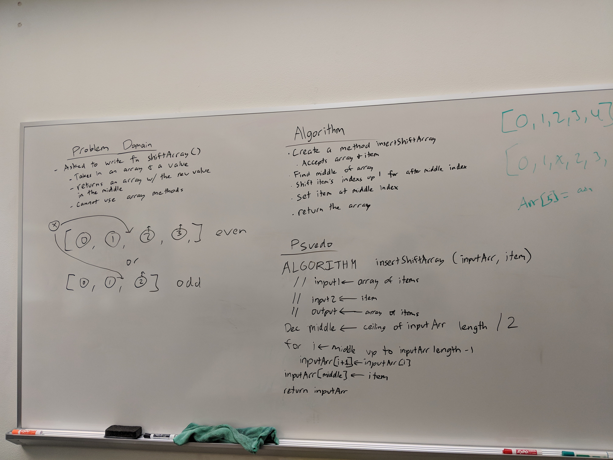

#02 Insert and shift middle index of array
Create a function that will insert a value into the center of an array.

## Challenge
Create a function that will insert a value into the center of an array without using any built in methods. Make it a module so it may be reused. 

## Solution
