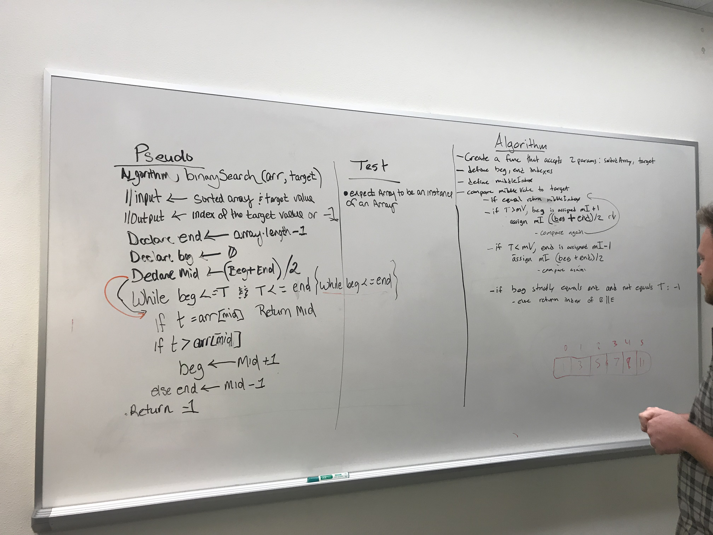

#03 Binary Search
Create a function that will search a sorted array and return the index of a given key. 

## Challenge
Create a function that will search a sorted array and return the index of a given key. If the element does not exist in the array, return -1. 

## Solution
